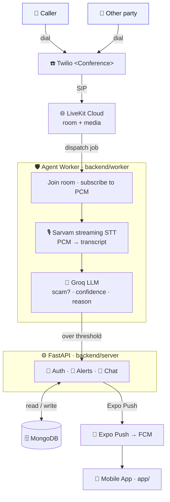

# 🛡️ cybersec-agent

Real-time protection against phone and chat scams, tuned for Indian users
(Hindi / English / Hinglish and the 22 official languages). 🇮🇳

The product is **notification-first**: an AI agent listens to a call the user has
explicitly added it to, detects social-engineering patterns (OTP/KYC pressure,
account-block threats, urgency, UPI/payment pressure, bank/police impersonation),
and pushes an explained warning to the user's phone — in plain language, while the
call is still happening.

> The agent only ever listens to a call it has been **added to as a participant**.
> It is never a covert tap.

## ✨ Capabilities

- 📞 **Live call protection** — an agent joins the call, transcribes it, and flags
  scam patterns as they build across the conversation.
- 🚨 **Explained alerts** — every warning names the red flags and the reason, not just
  a "scam" label.
- 💬 **Chat risk checks** — describe anything suspicious and get a risk assessment,
  backed by graph intelligence over related signals.
- 🗺️ **Geospatial intelligence** — cybercrime hotspots across India.
- 🔄 **Evolving detection** — the system tracks the latest fraud patterns over time.

## 🏗️ Architecture

Three runtimes. The agent worker and the API server are separate processes (and
separate containers); LiveKit Cloud is the managed media server.



### 🧩 Components

| Path            | What it is |
|-----------------|------------|
| `app/`          | Expo / React Native app. Onboarding, auth (multi-step signup + login, token stored in the device keychain), and the protection screens. |
| `backend/server`| FastAPI service: auth, alert intake, chat, and push delivery. MongoDB via async `pymongo`. |
| `backend/worker`| LiveKit agent worker: joins the room, runs STT + detection per call in an isolated subprocess. |
| `backend/shared`| Code shared by both processes — the detector (Groq + JSON schema + hysteresis) and the Sarvam STT client. |

## 🧰 Stack

- 📱 **Mobile:** React Native + Expo (managed), expo-router, Reanimated, expo-secure-store.
- ☎️ **Telephony / media:** Twilio `<Conference>` → SIP → LiveKit Cloud.
- 🎙️ **STT:** Sarvam streaming (Hinglish / code-mixing, 16kHz PCM).
- 🧠 **Detection LLM:** Groq (Llama 3.3 70B), strict-JSON output with hysteresis to
  avoid false alarms.
- ⚙️ **API:** FastAPI + MongoDB (`pymongo` async).
- 📨 **Push:** Expo Push API → FCM.
- 🐳 **Deploy:** Docker Compose (server + worker + mongo); LiveKit is Cloud-hosted.

## 🚀 Running locally

Backend (single `uv` project rooted at `backend/`):

```bash
docker compose up                                   # server + worker + mongo
# or individually:
uv run uvicorn server.app:app --host 0.0.0.0 --port 8000
uv run python -m worker.agent dev
```

App:

```bash
cd app && bun expo start
```

Point the app at the backend via `EXPO_PUBLIC_API_URL` (or `app/constants/config.ts`).
On a real phone use the machine's LAN IP or an ngrok URL — `localhost` is the phone.

## 📦 Building the APK

Push notifications require a real APK (not Expo Go). Build manually:

```bash
cd app && eas build -p android --profile preview
```

Or automatically via CI/CD — push a release tag and GitHub Actions builds it:

```bash
git tag v1.0.0
git push origin v1.0.0
```

The workflow (`.github/workflows/build-apk.yml`) triggers on `v*` tags and runs
`eas build` using the `EXPO_TOKEN` secret stored in GitHub → Settings → Secrets.
